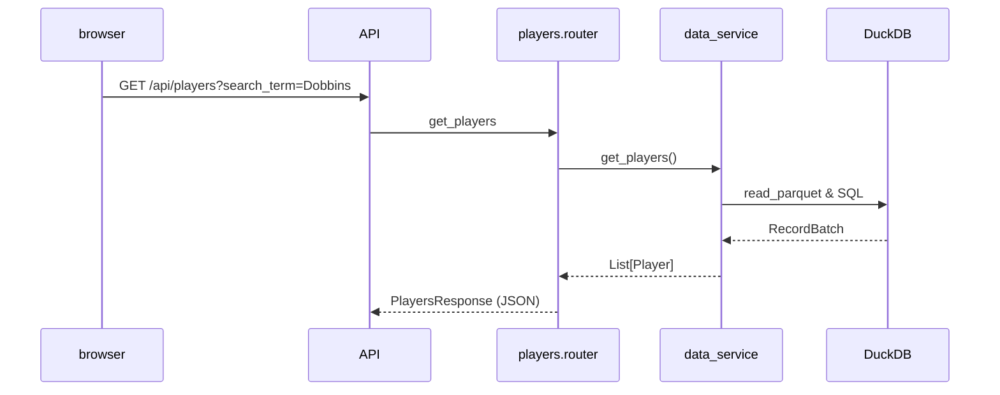
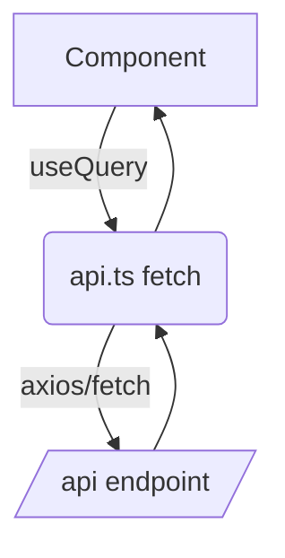

# Developer Architecture Guide
*Scope: FastAPI backend + React-TS frontend – 2025-07-10*

> This guide is intentionally concise. Each section is self-contained; jump directly to the layer you need to modify.

---

## 1. Backend (FastAPI)
### 1.1 Module Layout
```text
backend/app/
├─ core/            # settings, logging
├─ models/          # Pydantic schemas (contracts)
├─ services/
│  └─ data_service.py  # Polars + DuckDB queries (singleton)
├─ api/             # Thin routers only
│  ├─ __init__.py   # aggregates routers with prefixes
│  ├─ metadata.py   # /api/metadata/*
│  ├─ players.py    # /api/players/*
│  ├─ positions.py  # /api/positions/*
│  └─ combinations.py # /api/combinations/*
└─ main.py          # FastAPI app factory & CORS
```

### 1.2 Request Flow

*Routers remain thin (no heavy logic) and delegate to `data_service`.*

### 1.3 DataService Responsibilities
* Executes heavy aggregations in **DuckDB** SQL for analytics, players list, and combinations.
* Benchmarks a Polars equivalent and **automatically falls back** when Polars is >20 % faster (see `analytics_service.py`).
* In-process `@lru_cache` for hot endpoints to avoid recomputation.
* No external services – ideal for stateless single-process deployment.

---

## 2. Frontend (React + Vite)
### 2.1 Directory Map
```text
frontend/src/
├─ components/
│  ├─ layout/       # Shell: Header, Sidebar, MainContent
│  ├─ views/        # Pages: OverviewView, PlayersView, PositionsView, CombinationsView
│  └─ ui/           # Reusable atoms/molecules (PlayerTable, HistogramChart, ...)
├─ api/             # api.ts – fetch + TanStack Query wrappers
├─ hooks/           # custom hooks (e.g., usePlayers)
├─ store/           # Zustand global slices
├─ types/           # Generated from backend schemas
└─ index.tsx        # App entry
```

### 2.2 Data Fetch Lifecycle


### 2.3 State Management Rules
* **Server state** (remote data) → TanStack Query
* **UI state** (selected tab, collapsed panels) → Zustand or local `useState`

---

## 3. Cross-Cutting Concerns
| Concern | Implementation |
|---------|----------------|
| Type Safety | Pydantic ↔ `datamodel-codegen` → TypeScript types |
| Error Handling | Backend raises `HTTPException`; Frontend shows Mantine `Alert` + retry |
| Caching | Browser (TanStack) + backend `lru_cache` |
| Logging | `logging` stdlib with structured INFO/ERROR; console.debug in FE |

---

## 4. Extending the System
1. **Add new endpoint**
   1. Create query in `data_service.py`.
   2. Expose via new function in appropriate `api/*.py`.
   3. Update `schemas.py` if response shape differs.
2. **Add new front-end view**
   1. Create `NewView.tsx` under `views/`.
   2. Register route in React Router (planned) or sidebar link.
   3. Use existing `api.ts` or add new fetch wrapper.


---

## 5. Deployment & Ops (Lean Stack)
* **Runtime**: Single Docker container (FastAPI + Uvicorn) sized for ≤ 400 MiB RAM on EC2 `t3a.small` Spot.
* **Build**: Multi-stage Dockerfile (python:3.12-slim → final) ~110 MB image.
* **CI/CD**: GitHub Action – lint → test → build → push.  Post-push `deploy.sh` (below) SSHs into the instance and pulls the latest tag.
* **Resilience**: `docker run --restart=always`; Auto Scaling Group desired = 1 to auto-replace on pre-emption.
* **Observability**: Structured `uvicorn` JSON logs shipped via CloudWatch Agent.
* **Security**: Inbound 443/80 only; API served behind CloudFront, CORS allowlist enforced.

---
*End of Developer Architecture Guide*
