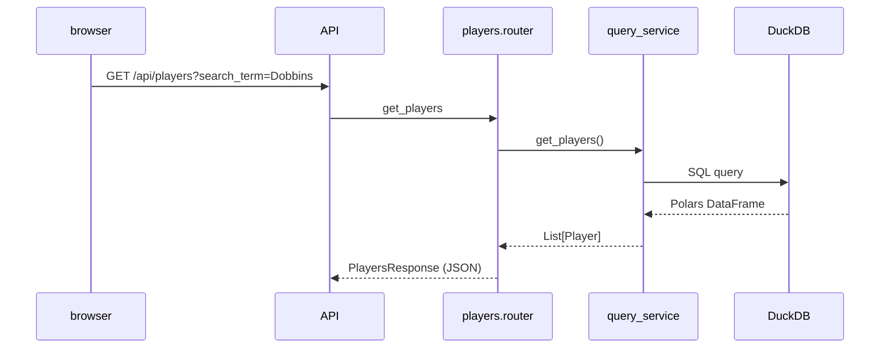
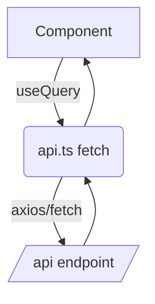

# Developer Architecture Guide

**Scope**: FastAPI backend + React-TS frontend – 2024-07-16

> This guide is intentionally concise. Each section is self-contained; jump directly to the layer you need to modify. For in-depth backend details, see [backend_detailed.md](backend_detailed.md).

---

## 1. Backend (FastAPI)

### 1.1 Module Layout

```text
backend/app/
├─ __init__.py
├─ main.py          # FastAPI app factory & CORS
├─ core/            # settings, logging
│  ├─ __init__.py
│  └─ config.py
├─ models/          # Pydantic schemas (contracts)
│  ├─ __init__.py
│  └─ schemas.py
├─ services/
│  ├─ __init__.py
│  └─ query_service.py     # Unified data operations (DuckDB)
├─ api/             # Thin routers only
│  ├─ __init__.py   # aggregates routers with prefixes
│  ├─ analytics.py  # /api/analytics/* (heat-map, stacks, etc.)
│  ├─ combinations.py # /api/combinations/*
│  ├─ metadata.py   # /api/metadata/*
│  ├─ players.py    # /api/players/*
│  └─ positions.py  # /api/positions/*
```

### 1.2 Request Flow


```mermaid
sequenceDiagram
    browser->>API: GET /api/players?search_term=Dobbins
    API->>players.router: get_players
    players.router->>query_service: get_players()
    query_service->>DuckDB: SQL query
    DuckDB-->>query_service: Polars DataFrame
    query_service-->>players.router: List[Player]
    players.router-->>API: PlayersResponse (JSON)
```

*Routers remain thin (no heavy logic) and delegate to the unified `query_service`.*

### 1.3 Service Responsibilities

- **QueryService**: Unified service handling all data operations via DuckDB. Loads Parquet data at startup, executes SQL queries, and provides all functionality including player lookups, analytics, and statistics. Replaces the previous DataService, AnalyticsService, and DuckDBService with a single, coherent interface.

*No external services – ideal for stateless single-process deployment.*

---

## 2. Frontend (React + Vite)

### 2.1 Directory Map

```text
frontend/src/
├─ components/
│  ├─ layout/       # Shell: Header, Sidebar, MainContent
│  ├─ views/        # Pages: OverviewView, PlayersView, PositionsView, CombinationsView
│  └─ ui/           # Reusable atoms/molecules (PlayerTable, HistogramChart, ..., DraftSlotControls)
├─ api/             # api.ts – fetch + TanStack Query wrappers
├─ hooks/           # custom hooks (e.g., usePlayers)
├─ store/           # Zustand global slices
├─ types/           # Generated from backend schemas
└─ index.tsx        # App entry
```

### 2.2 Data Fetch Lifecycle


```mermaid
flowchart TD
    A[Component] -->|useQuery| B(api.ts fetch)
    B -->|axios/fetch| C[/api endpoint/]
    C --> B
    B --> A
```

### 2.3 State Management Rules

- **Server state** (remote data) → TanStack Query
- **UI state** (selected tab, collapsed panels) → Zustand or local `useState`

### 2.4 Draft Slot Correlation Component Tree

```text
AnalyticsView (Tabs)
└─ DraftSlotTab
   ├─ DraftSlotControls (NumberInput, SegmentedControl, Select)
   ├─ BarChartWrapper (Recharts)
   └─ DraftSlotTable (Mantine Table)
```

#### Data Flow

1. `DraftSlotTab` initialises TanStack `useQuery(['draft-slot', slot, metric, topN])`.
2. Query key hits `api.getDraftSlotCorrelation` which performs `axios.get('/api/analytics/draft-slot', {params})`.
3. Backend `analytics_router.get_draft_slot_correlation` delegates to `AnalyticsService.get_draft_slot_correlation(slot, metric, top_n)` (DuckDB).
4. Response arrives → `DraftSlotTab` sets chart + table data; controls update query key.
5. React Query cache ensures instant refetch on metric/topN change.

---

## 3. Cross-Cutting Concerns

| Concern | Implementation |
|---------|----------------|
| Type Safety | Pydantic ↔ `datamodel-codegen` → TypeScript types |
| Error Handling | Backend raises `HTTPException`; Frontend shows Mantine `Alert` + retry |
| Caching | Browser (TanStack) + backend `lru_cache` |
| Logging | `logging` stdlib with structured INFO/ERROR; console.debug in FE |

---

## 4. Extending the System

1. **Add new endpoint**
   1. Create query in `data_service.py`.
   2. Expose via new function in appropriate `api/*.py`.
   3. Update `schemas.py` if response shape differs.
2. **Add new front-end view**
   1. Create `NewView.tsx` under `views/`.
   2. Register route in React Router (planned) or sidebar link.
   3. Use existing `api.ts` or add new fetch wrapper.

---

## 5. Deployment & Ops (Lean Stack)

### 5.1 Runtime Topology

| Container | Responsibility | Ports |
|-----------|----------------|-------|
| `app`     | FastAPI + built React assets | `8000` (loop-back only) |
| `nginx`   | Reverse-proxy, TLS termination, static cache | `80` / `443` |

`docker-compose.yml` contains **only these two long-running services**. The `certbot` service is defined in the same file under the `certbot` profile for manual / cron-driven issuance and renewal.

### 5.2 HTTPS Lifecycle (Let’s Encrypt, Webroot)

Step | Tool | File | Notes
------|------|------|------
Bootstrap (one-time) | `scripts/bootstrap-cert.sh` | – | Spins up nginx (HTTP-only), calls `certbot/certbot certonly …`, then reloads nginx with the new certs. Requires `LETSENCRYPT_EMAIL` env var.
Renew (every 60 days) | `docker-compose.yml` (`certbot` profile) | – | Cron job runs `docker compose --profile certbot run --rm certbot renew --webroot -w /var/www/certbot && docker compose exec nginx nginx -s reload`.

Why this design?

• **Separation of concerns** – runtime stack stays untouched by one-off tasks.
• **No variable-escaping hacks** – email is supplied by the caller shell, not Compose.
• **Stateless** – renewal container is ephemeral; only certs persist on host volume `./certbot/conf`.

### 5.3 Build & Release Pipeline

– Multi-stage Dockerfile (python:3.12-slim) ⇒ ~110 MB final image.<br/>
– GitHub Actions workflow: lint → test → build → push 🔜 run `scripts/deploy.sh` (SSH + `docker compose pull && up -d`).

### 5.4 Resilience & Observability

– Containers started with `restart: unless-stopped`.<br/>
– CloudWatch Agent ships structured logs from both FastAPI (JSON) and nginx (access + error).<br/>
– Auto Scaling Group desired = 1 ensures automatic replacement on Spot interruption.

### 5.5 Security Posture

– Security Group ingress: **80, 443** from `0.0.0.0/0`.<br/>
– CORS allow-list enforced in FastAPI based on `ALLOWED_ORIGINS` env var.<br/>
– HSTS, X-Frame-Options, CSP headers set in `nginx.conf`.

---

## 6. Tech Stack & Endpoint Matrix

### 6.1 Technology Stack

Layer | Tech | Notes
---|---|---
Front-End | React 18 + TS, Vite, Tailwind v3, Mantine 7, Recharts 2 | Theme: navy `#002D72`, orange `#FF7F0E`
State | TanStack Query 5, Zustand | Query key = endpoint+params
Back-End | Python 3.12, FastAPI 0.116, Polars 0.20 | Uvicorn dev server
Data | 12 MB Parquet of 3.6 M picks | Loaded once at startup
Infra | Local: bare; Prod: EC2 Spot single container | CORS enabled
Tooling | Ruff, Black; ESLint + Prettier | GitHub Actions CI

### 6.2 Backend Layout & Endpoints

| Path | Responsibility |
|------|----------------|
| `app/main.py` | Instantiate FastAPI, include routers, CORS, health |
| `app/api/metadata.py` | `GET /metadata/` |
| `app/api/players.py` | Players list `/players/`, search, details |
| `app/api/positions.py` | Pos stats, first-player stats, counts |
| `app/api/combinations.py` | Combos + roster construction |
| `app/services/data_service.py` | Polars queries (singleton) |
| `app/models/schemas.py` | Pydantic models (Player, Responses) |

#### 6.2.1 Endpoint Matrix (excerpt)

Method | Route | Handler | Params
---|---|---|---
GET | `/` | `root` | –
GET | `/health` | `health_check` | –
GET | `/api/metadata/` | `get_metadata` | –
GET | `/api/players/` | `get_players` | positions, search_term, limit, offset, sort_by, sort_order
GET | `/api/players/search` | `search_players` | q, limit
GET | `/api/players/details` | `get_player_details` | player_name, position, team
GET | `/api/positions/stats` | `get_position_stats` | –
GET | `/api/positions/stats/first_player` | `get_first_player_position_stats` | –
GET | `/api/positions/stats/{position}/by_round` | `get_position_draft_counts_by_round` | aggregation
GET | `/api/combinations/` | `get_player_combinations` | required_players[], n_rounds, limit
GET | `/api/combinations/roster-construction/` | `get_roster_construction` | –
GET | `/api/analytics/heat-map` | `get_heat_map` | –
GET | `/api/analytics/stacks` | `get_stacks` | n_rounds, limit
GET | `/api/analytics/draft-slot` | `get_draft_slot` | slot, metric, top_n
GET | `/api/analytics/drift` | `get_adp_drift` | limit

### 6.3 DataService Highlights

Function | Description (Polars)
---|---
`get_players` | Filter + sort df, slice for pagination
`get_player_details` | Aggregate stats + generate histogram bins (dynamic)
`get_player_combinations` | Group by team → check required players drafted within N rounds
`get_roster_construction` | Group by team then pivot(position,count)
Note: `@lru_cache(maxsize=128)` memoises recent results.

### 6.4 DuckDB & AnalyticsService

DuckDB is embedded via `duckdb_service` and leveraged for SQL-heavy aggregations (heat map, stack finder, ADP drift, draft slot correlation). `AnalyticsService` benchmarks execution time and falls back to Polars when DuckDB is >20% slower **and** >50ms absolute. This hybrid approach ensures optimal performance without added complexity.

Key points:

- Single in-memory DuckDB connection, `PRAGMA enable_object_cache`, view on Parquet file.
- Polars dataframe also registered as `picks_df` for hybrid queries.
- Fallback guard pattern:

  ```python
  t0 = time.perf_counter()
  duck_df = duckdb_service.query(sql)
  dur_duck = time.perf_counter() - t0
  if dur_duck > 0.05 and dur_pol < dur_duck * 0.8:
      return pol_result
  ```

- Ensures the fastest path is served without changing public API contracts.

See `docs/adr/ADR-0001-duckdb-polars-hybrid.md` for full rationale.

### 6.5 Frontend Layout

Dir | Key Components
---|---
`src/components/layout/` | `Header`, `Sidebar`, `MainContent`
`src/components/views/` | `OverviewView`, `PlayersView`, `PositionsView`, `CombinationsView`
`src/components/ui/` | `PlayerTable`, `PlayerAutocomplete`, `HistogramChart`, etc.
`src/api/` | `api.ts` wrapper over fetch + TanStack Query
`src/types/` | Shared TS mirrors of backend schemas

#### 6.5.1 Player Click Data Flow

1. `PlayerTable` row `<a>` triggers `handlePlayerClick` in `PlayersView`.
2. Zustand `selectedPlayer` state updated.
3. React-Query fetches `GET /players/details`.
4. Mantine `Collapse` expands with stats grid + Recharts histogram.

### 6.6 Dev Scripts

| Step | Command |
|------|---------|
| Install backend deps | `pip install -r backend/requirements.txt` |
| Run backend | `uvicorn app.main:app --reload --port 8000` |
| Install FE deps | `cd frontend && pnpm i` |
| Run FE dev | `pnpm dev` (opens http://localhost:5173) |

### 6.7 Testing Status

Layer | Framework | Coverage | Status
---|---|---|---
Backend | Pytest | 23 tests passing | ✅ Comprehensive coverage
Frontend | Vitest + RTL | ~50% (views, hooks covered) | 🔄 In progress
E2E | Playwright | backlog | 📋 Planned

**Recent Backend Improvements (January 2025):**

- Fixed cross-platform path resolution issues
- Improved test fixture reliability
- Enhanced CI/CD compatibility
- All 23 tests passing on Windows/Linux/macOS

For detailed frontend test documentation, see [frontend_tests.md](frontend_tests.md).

For detailed backend test documentation, see [backend_tests.md](backend_tests.md).

### 6.8 Observed Pain Points / Tech Debt

- No deep-link routing to specific player or position (frontend).
- Combination endpoint heavy payload; consider server pagination.
- DataService caches lost on deploy; investigate persisted cache strategy.
- Tailwind 4 upgrade blocked by PostCSS plugin.
- Potential memory pressure if dataset grows beyond current 12MB Parquet.
- Dependency versions not pinned, risking updates.

For detailed backend issues and lean improvements, see [backend_detailed.md](backend_detailed.md).

---

End of Architecture & Engineering Guide
