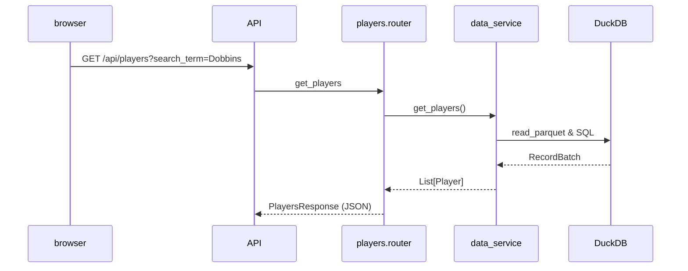
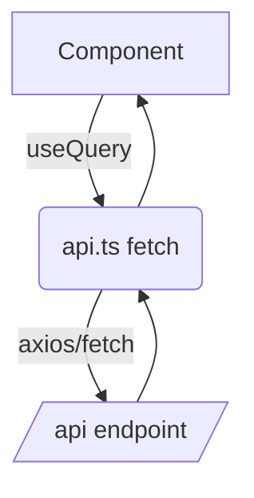

# Developer Architecture Guide
*Scope: FastAPI backend + React-TS frontend – 2025-07-10*

> This guide is intentionally concise. Each section is self-contained; jump directly to the layer you need to modify.

---

## 1. Backend (FastAPI)
### 1.1 Module Layout
```text
backend/app/
├─ core/            # settings, logging
├─ models/          # Pydantic schemas (contracts)
├─ services/
│  └─ data_service.py  # Polars + DuckDB queries (singleton)
├─ api/             # Thin routers only
│  ├─ __init__.py   # aggregates routers with prefixes
│  ├─ metadata.py   # /api/metadata/*
│  ├─ players.py    # /api/players/*
│  ├─ positions.py  # /api/positions/*
│  └─ combinations.py # /api/combinations/*
└─ main.py          # FastAPI app factory & CORS
```

### 1.2 Request Flow

```mermaid
sequenceDiagram
    browser->>API: GET /api/players?search_term=Dobbins
    API->>players.router: get_players
    players.router->>data_service: get_players()
    data_service->>DuckDB: read_parquet & SQL
    DuckDB-->>data_service: RecordBatch
    data_service-->>players.router: List[Player]
    players.router-->>API: PlayersResponse (JSON)
```
*Routers remain thin (no heavy logic) and delegate to `data_service`.*

### 1.3 DataService Responsibilities
* Executes heavy aggregations in **DuckDB** SQL for analytics, players list, and combinations.
* Benchmarks a Polars equivalent and **automatically falls back** when Polars is >20 % faster (see `analytics_service.py`).
* In-process `@lru_cache` for hot endpoints to avoid recomputation.
* No external services – ideal for stateless single-process deployment.

---

## 2. Frontend (React + Vite)
### 2.1 Directory Map
```text
frontend/src/
├─ components/
│  ├─ layout/       # Shell: Header, Sidebar, MainContent
│  ├─ views/        # Pages: OverviewView, PlayersView, PositionsView, CombinationsView
│  └─ ui/           # Reusable atoms/molecules (PlayerTable, HistogramChart, ..., DraftSlotControls)
├─ api/             # api.ts – fetch + TanStack Query wrappers
├─ hooks/           # custom hooks (e.g., usePlayers)
├─ store/           # Zustand global slices
├─ types/           # Generated from backend schemas
└─ index.tsx        # App entry
```

### 2.2 Data Fetch Lifecycle

```mermaid
flowchart TD
    A[Component] -->|useQuery| B(api.ts fetch)
    B -->|axios/fetch| C[/api endpoint/]
    C --> B
    B --> A
```

### 2.3 State Management Rules
* **Server state** (remote data) → TanStack Query
* **UI state** (selected tab, collapsed panels) → Zustand or local `useState`

### 2.4 Draft Slot Correlation Component Tree
```text
AnalyticsView (Tabs)
└─ DraftSlotTab
   ├─ DraftSlotControls (NumberInput, SegmentedControl, Select)
   ├─ BarChartWrapper (Recharts)
   └─ DraftSlotTable (Mantine Table)
```

**Data Flow**
1. `DraftSlotTab` initialises TanStack `useQuery(['draft-slot', slot, metric, topN])`.
2. Query key hits `api.getDraftSlotCorrelation` which performs `axios.get('/api/analytics/draft-slot', {params})`.
3. Backend `analytics_router.get_draft_slot_correlation` delegates to `AnalyticsService.get_draft_slot_correlation(slot, metric, top_n)` (DuckDB).
4. Response arrives → `DraftSlotTab` sets chart + table data; controls update query key.
5. React Query cache ensures instant refetch on metric/topN change.

---

## 3. Cross-Cutting Concerns
| Concern | Implementation |
|---------|----------------|
| Type Safety | Pydantic ↔ `datamodel-codegen` → TypeScript types |
| Error Handling | Backend raises `HTTPException`; Frontend shows Mantine `Alert` + retry |
| Caching | Browser (TanStack) + backend `lru_cache` |
| Logging | `logging` stdlib with structured INFO/ERROR; console.debug in FE |

---

## 4. Extending the System
1. **Add new endpoint**
   1. Create query in `data_service.py`.
   2. Expose via new function in appropriate `api/*.py`.
   3. Update `schemas.py` if response shape differs.
2. **Add new front-end view**
   1. Create `NewView.tsx` under `views/`.
   2. Register route in React Router (planned) or sidebar link.
   3. Use existing `api.ts` or add new fetch wrapper.


---

## 5. Deployment & Ops (Lean Stack)
* **Runtime**: Single Docker container (FastAPI + Uvicorn) sized for ≤ 400 MiB RAM on EC2 `t3a.small` Spot.
* **Build**: Multi-stage Dockerfile (python:3.12-slim → final) ~110 MB image.
* **CI/CD**: GitHub Action – lint → test → build → push.  Post-push `deploy.sh` (below) SSHs into the instance and pulls the latest tag.
* **Resilience**: `docker run --restart=always`; Auto Scaling Group desired = 1 to auto-replace on pre-emption.
* **Observability**: Structured `uvicorn` JSON logs shipped via CloudWatch Agent.
* **Security**: Inbound 443/80 only; API served behind CloudFront, CORS allowlist enforced.

---
## 6. Tech Stack & Endpoint Matrix

### 6.1 Technology Stack
Layer | Tech | Notes
---|---|---
Front-End | React 18 + TS, Vite, Tailwind v3, Mantine 7, Recharts 2 | Theme: navy `#002D72`, orange `#FF7F0E`
State | TanStack Query 5, Zustand | Query key = endpoint+params
Back-End | Python 3.12, FastAPI 0.116, Polars 0.20 | Uvicorn dev server
Data | 12 MB Parquet of 3.6 M picks | Loaded once at startup
Infra | Local: bare; Prod: EC2 Spot single container | CORS enabled
Tooling | Ruff, Black; ESLint + Prettier | GitHub Actions CI

### 6.2 Backend Layout & Endpoints
| Path | Responsibility |
|------|----------------|
| `app/main.py` | Instantiate FastAPI, include routers, CORS, health |
| `app/api/metadata.py` | `GET /metadata/` |
| `app/api/players.py` | Players list `/players/`, search, details |
| `app/api/positions.py` | Pos stats, first-player stats, counts |
| `app/api/combinations.py` | Combos + roster construction |
| `app/services/data_service.py` | Polars queries (singleton) |
| `app/models/schemas.py` | Pydantic models (Player, Responses) |

#### 6.2.1 Endpoint Matrix (excerpt)
Method | Route | Handler | Params
---|---|---|---
GET | `/` | `root` | –
GET | `/health` | `health_check` | –
GET | `/api/metadata/` | `get_metadata` | –
GET | `/api/players/` | `get_players` | positions, search_term, limit, offset, sort_by, sort_order
GET | `/api/players/search` | `search_players` | q, limit
GET | `/api/players/details` | `get_player_details` | player_name, position, team
GET | `/api/positions/stats` | `get_position_stats` | –
GET | `/api/positions/stats/first_player` | `get_first_player_position_stats` | –
GET | `/api/positions/stats/{position}/by_round` | `get_position_draft_counts_by_round` | aggregation
GET | `/api/combinations/` | `get_player_combinations` | required_players[], n_rounds, limit
GET | `/api/combinations/roster-construction/` | `get_roster_construction` | –
GET | `/api/analytics/draft-slot` | `get_draft_slot_correlation` | slot, metric, top_n

### 6.3 DataService Highlights
Function | Description (Polars)
---|---
`get_players` | Filter + sort df, slice for pagination
`get_player_details` | Aggregate stats + generate histogram bins (dynamic)
`get_player_combinations` | Group by team → check required players drafted within N rounds
`get_roster_construction` | Group by team then pivot(position,count)
Note: `@lru_cache(maxsize=128)` memoises recent results.

### 6.4 DuckDB & AnalyticsService
DuckDB is embedded via `duckdb_service` and leveraged for SQL-heavy aggregations (heat map, stack finder, ADP drift). `AnalyticsService` benchmarks execution time and falls back to Polars when DuckDB is >20 % slower **and** >50 ms absolute.

### 6.5 Frontend Layout
Dir | Key Components
---|---
`src/components/layout/` | `Header`, `Sidebar`, `MainContent`
`src/components/views/` | `OverviewView`, `PlayersView`, `PositionsView`, `CombinationsView`
`src/components/ui/` | `PlayerTable`, `PlayerAutocomplete`, `HistogramChart`, etc.
`src/api/` | `api.ts` wrapper over fetch + TanStack Query
`src/types/` | Shared TS mirrors of backend schemas

#### 6.5.1 Player Click Data Flow
1. `PlayerTable` row `<a>` triggers `handlePlayerClick` in `PlayersView`.
2. Zustand `selectedPlayer` state updated.
3. React-Query fetches `GET /players/details`.
4. Mantine `Collapse` expands with stats grid + Recharts histogram.

### 6.6 Dev Scripts
| Step | Command |
|------|---------|
| Install backend deps | `pip install -r backend/requirements.txt` |
| Run backend | `uvicorn app.main:app --reload --port 8000` |
| Install FE deps | `cd frontend && pnpm i` |
| Run FE dev | `pnpm dev` (opens http://localhost:5173) |

### 6.7 Testing Status
Layer | Framework | Coverage
---|---|---
Backend | Pytest | ~20 % (data_service unit tests)
Frontend | Vitest + RTL | ~15 % (`DraftSlotTab` covered)
E2E | Playwright | backlog

### 6.8 Observed Pain Points / Tech Debt
* No deep-link routing to specific player or position.
* Combination endpoint heavy payload; consider server pagination.
* DataService caches lost on deploy; investigate persisted cache strategy.
* Tailwind 4 upgrade blocked by PostCSS plugin.

---
*End of Architecture & Engineering Guide*
