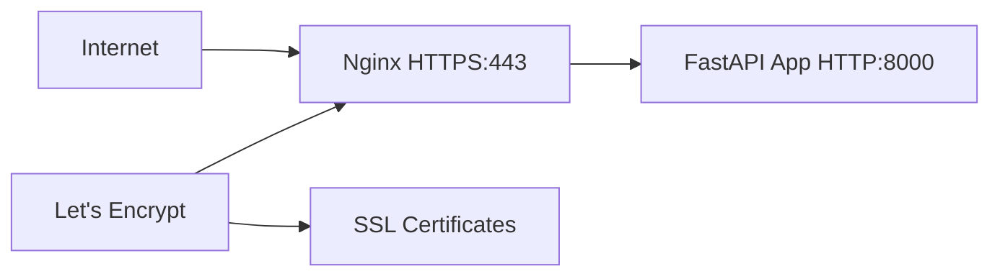

# HTTPS Setup Guide

This guide explains how to set up HTTPS for your Fantasy Analytics application using Let's Encrypt SSL certificates.

## Overview

The setup uses:

- **Nginx** as a reverse proxy to handle HTTPS termination
- **Let's Encrypt** for free SSL certificates
- **Certbot** for automatic certificate management
- **Docker Compose** for orchestration

## Architecture



## Prerequisites

1. **Domain Name**: `thesignalcallers.com` pointing to your EC2 instance
2. **EC2 Security Group**: Open ports 80 and 443
3. **Email Address**: For Let's Encrypt notifications

## Setup Steps

### 1. Update Configuration

Edit `scripts/setup-https.sh` and replace:

```bash
EMAIL="your-email@example.com"  # Replace with your actual email
```

### 2. Run the Setup Script

```bash
chmod +x scripts/setup-https.sh
./scripts/setup-https.sh
```

### 3. Verify Setup

Check that HTTPS is working:

```bash
curl -I https://thesignalcallers.com
```

## Production Deployment

### Using the New Docker Compose

```bash
# Start all services (app + nginx + certbot)
docker-compose -f docker-compose.prod.yml up -d

# View logs
docker-compose -f docker-compose.prod.yml logs -f

# Stop services
docker-compose -f docker-compose.prod.yml down
```

### Manual Certificate Renewal

```bash
# Renew certificates manually
./scripts/renew-ssl.sh

# Check certificate expiration
docker-compose -f docker-compose.prod.yml run --rm certbot certificates
```

## Security Features

### Rate Limiting

- API endpoints: 10 requests/second with burst of 20
- General traffic: 30 requests/second with burst of 10

### Security Headers

- `X-Frame-Options: SAMEORIGIN`
- `X-Content-Type-Options: nosniff`
- `X-XSS-Protection: 1; mode=block`
- `Strict-Transport-Security: max-age=31536000; includeSubDomains`

### SSL Configuration

- TLS 1.2 and 1.3 only
- Strong cipher suites
- HSTS enabled
- HTTP to HTTPS redirect

## Troubleshooting

### Certificate Issues

```bash
# Check certificate status
docker-compose -f docker-compose.prod.yml run --rm certbot certificates

# Force certificate renewal
docker-compose -f docker-compose.prod.yml run --rm certbot renew --force-renewal
```

### Nginx Issues

```bash
# Check Nginx configuration
docker-compose -f docker-compose.prod.yml exec nginx nginx -t

# View Nginx logs
docker-compose -f docker-compose.prod.yml logs nginx
```

### Application Issues

```bash
# Check application logs
docker-compose -f docker-compose.prod.yml logs app

# Restart application
docker-compose -f docker-compose.prod.yml restart app
```

## Cost Analysis

This setup is **completely free**:

- Let's Encrypt certificates: Free
- Nginx: Free
- Certbot: Free
- No additional AWS services required

## Maintenance

### Automatic Renewal

Certificates auto-renew every 60 days via cron job.

### Monitoring

Check certificate expiration:

```bash
# Add to your monitoring
echo "Certificate expires in $(docker-compose -f docker-compose.prod.yml run --rm certbot certificates | grep 'VALID' | awk '{print $2}') days"
```

### Updates

Keep images updated:

```bash
docker-compose -f docker-compose.prod.yml pull
docker-compose -f docker-compose.prod.yml up -d
```

## Migration from HTTP-only

If you're currently running HTTP-only:

1. **Backup current setup**:

   ```bash
   docker-compose down
   cp docker-compose.yml docker-compose.yml.backup
   ```

2. **Deploy new setup**:

   ```bash
   ./scripts/setup-https.sh
   ```

3. **Verify migration**:

   ```bash
   curl -I https://thesignalcallers.com
   ```

4. **Update DNS** (if needed):
   Ensure `thesignalcallers.com` points to your EC2 instance.

## Next Steps

After HTTPS is working:

1. Update your frontend API calls to use HTTPS
2. Test all functionality over HTTPS
3. Monitor certificate renewal
4. Consider adding monitoring/alerting for certificate expiration
