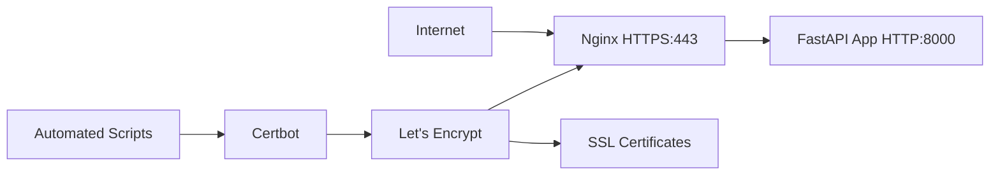

# HTTPS Setup Guide

This guide provides comprehensive instructions for setting up HTTPS for your Fantasy Analytics application using Let's Encrypt SSL certificates.

## Overview

The HTTPS setup uses a modern, secure architecture with:

- **Nginx** as a reverse proxy for HTTPS termination
- **Let's Encrypt** for free SSL certificates
- **Certbot** for automatic certificate management
- **Docker Compose** for container orchestration
- **Automated scripts** for setup and renewal

## Architecture



## Prerequisites

### 1. Domain Configuration

- **Primary Domain**: `thesignalcallers.com` pointing to your EC2 instance
- **Subdomain**: `www.thesignalcallers.com` pointing to the same EC2 instance
- **EC2 IP**: `18.221.177.254`

### 2. AWS Route 53 DNS Records

You need these A records in your Route 53 hosted zone:

| Name | Type | Value | TTL |
|------|------|-------|-----|
| `thesignalcallers.com` | A | `18.221.177.254` | 300 |
| `www` | A | `18.221.177.254` | 300 |

### 3. EC2 Security Group

Ensure your EC2 security group allows:

- **Port 80** (HTTP) - for initial certificate request
- **Port 443** (HTTPS) - for secure traffic

### 4. Email Configuration

Set up your email address in `env.production`:

```bash
SSL_EMAIL=your-actual-email@example.com
```

## Quick Setup

### 1. One-Command Setup

```bash
# Make the script executable and run it
chmod +x scripts/fix-https-setup.sh
./scripts/fix-https-setup.sh
```

The script will:

- ✅ Check DNS resolution
- ✅ Create necessary directories
- ✅ Start services with temporary nginx config
- ✅ Test HTTP access
- ✅ Obtain SSL certificates for both domains
- ✅ Restore full HTTPS nginx config
- ✅ Set up automatic renewal
- ✅ Test HTTPS access

### 2. Manual Setup (Alternative)

If you prefer manual control:

```bash
# 1. Configure environment
echo "SSL_EMAIL=your-email@example.com" >> env.production

# 2. Start services
docker-compose -f docker-compose.prod.yml up -d nginx app

# 3. Obtain certificates
docker-compose -f docker-compose.prod.yml run --rm certbot

# 4. Test HTTPS
curl -I https://thesignalcallers.com
```

## Production Deployment

### Using Docker Compose Production

```bash
# Start all services
docker-compose -f docker-compose.prod.yml up -d

# View logs
docker-compose -f docker-compose.prod.yml logs -f

# Stop services
docker-compose -f docker-compose.prod.yml down

# Restart specific service
docker-compose -f docker-compose.prod.yml restart nginx
```

### Service Architecture

- **App Service**: FastAPI application on port 8000 (internal)
- **Nginx Service**: Reverse proxy on ports 80/443 (external)
- **Certbot Service**: SSL certificate management (on-demand)

## Security Features

### SSL/TLS Configuration

- **Protocols**: TLS 1.2 and 1.3 only
- **Cipher Suites**: Strong, modern ciphers
- **HSTS**: Strict Transport Security enabled
- **Certificate**: Covers both `thesignalcallers.com` and `www.thesignalcallers.com`

### Security Headers

```nginx
X-Frame-Options: SAMEORIGIN
X-Content-Type-Options: nosniff
X-XSS-Protection: 1; mode=block
Strict-Transport-Security: max-age=31536000; includeSubDomains
Referrer-Policy: strict-origin-when-cross-origin
Content-Security-Policy: default-src 'self'; script-src 'self'; style-src 'self' 'unsafe-inline';
```

### Rate Limiting

- **API Endpoints**: 10 requests/second with burst of 20
- **General Traffic**: 30 requests/second with burst of 10

## Certificate Management

### Automatic Renewal

Certificates are automatically renewed every 60 days via cron job.

### Manual Renewal

```bash
# Renew certificates manually
./scripts/renew-ssl.sh

# Check certificate status
docker-compose -f docker-compose.prod.yml run --rm certbot certificates

# Force renewal
docker-compose -f docker-compose.prod.yml run --rm certbot renew --force-renewal
```

### Certificate Monitoring

```bash
# Check expiration
docker-compose -f docker-compose.prod.yml run --rm certbot certificates | grep 'VALID'

# Monitor renewal logs
docker-compose -f docker-compose.prod.yml logs certbot
```

## Troubleshooting

### DNS Issues

```bash
# Check DNS resolution
dig +short thesignalcallers.com
dig +short www.thesignalcallers.com

# Both should return: 18.221.177.254
```

### Certificate Issues

```bash
# Check certificate status
docker-compose -f docker-compose.prod.yml run --rm certbot certificates

# View certbot logs
docker-compose -f docker-compose.prod.yml logs certbot

# Common issues:
# - DNS not pointing to correct IP
# - Port 80 blocked by firewall
# - Domain validation failed
```

### Nginx Issues

```bash
# Check nginx configuration
docker-compose -f docker-compose.prod.yml exec nginx nginx -t

# View nginx logs
docker-compose -f docker-compose.prod.yml logs nginx

# Restart nginx
docker-compose -f docker-compose.prod.yml restart nginx
```

### Application Issues

```bash
# Check application logs
docker-compose -f docker-compose.prod.yml logs app

# Test internal connectivity
docker-compose -f docker-compose.prod.yml exec nginx curl -I http://app:8000

# Restart application
docker-compose -f docker-compose.prod.yml restart app
```

### Common Error Solutions

#### "Connection refused" during certificate request

- Check EC2 security group allows port 80
- Verify DNS records point to correct IP
- Ensure nginx is running and accessible

#### "DNS problem: NXDOMAIN"

- Add missing DNS records in Route 53
- Wait for DNS propagation (5-10 minutes)
- Verify domain ownership

#### "Certificate not found"

- Check certificate files exist: `ls -la certbot/conf/live/thesignalcallers.com/`
- Verify nginx config points to correct certificate paths
- Restart nginx after certificate changes

## Maintenance

### Regular Tasks

- **Weekly**: Check certificate expiration
- **Monthly**: Update Docker images
- **Quarterly**: Review security headers and SSL configuration

### Updates

```bash
# Update all images
docker-compose -f docker-compose.prod.yml pull

# Restart with new images
docker-compose -f docker-compose.prod.yml up -d

# Check for updates
docker-compose -f docker-compose.prod.yml images
```

### Backup and Recovery

```bash
# Backup certificates
tar -czf certbot-backup-$(date +%Y%m%d).tar.gz certbot/

# Backup nginx config
cp nginx.conf nginx.conf.backup-$(date +%Y%m%d)

# Restore from backup
tar -xzf certbot-backup-YYYYMMDD.tar.gz
docker-compose -f docker-compose.prod.yml restart nginx
```

## Cost Analysis

This setup is **completely free**:

| Component | Cost | Notes |
|-----------|------|-------|
| Let's Encrypt certificates | Free | 90-day validity, auto-renewal |
| Nginx | Free | Open source |
| Certbot | Free | Open source |
| Docker | Free | Community edition |
| AWS Route 53 | ~$0.50/month | Hosted zone + queries |

**Total**: Less than $1/month for typical usage.

## Migration from HTTP-only

If migrating from HTTP-only deployment:

1. **Backup current setup**:

   ```bash
   docker-compose down
   cp docker-compose.yml docker-compose.yml.backup
   ```

2. **Update DNS records** in Route 53

3. **Run HTTPS setup**:

   ```bash
   ./scripts/fix-https-setup.sh
   ```

4. **Verify migration**:

   ```bash
   curl -I https://thesignalcallers.com
   curl -I https://www.thesignalcallers.com
   ```

## Scripts Reference

### fix-https-setup.sh

Comprehensive setup script that handles the entire HTTPS configuration process.

**Features**:

- DNS resolution checking
- Automatic backup of existing configs
- Certificate generation for both domains
- Automatic renewal setup
- Comprehensive error handling

### renew-ssl.sh

Simple renewal script for manual certificate updates.

**Usage**:

```bash
./scripts/renew-ssl.sh
```

## Next Steps

After HTTPS is working:

1. **Update frontend**: Ensure all API calls use HTTPS
2. **Test functionality**: Verify all features work over HTTPS
3. **Monitor renewal**: Set up alerts for certificate expiration
4. **Security audit**: Review security headers and SSL configuration
5. **Performance**: Monitor SSL handshake performance
6. **Backup strategy**: Implement regular certificate backups

## Support

For issues not covered in this guide:

1. Check the troubleshooting section above
2. Review Docker and nginx logs
3. Verify DNS configuration
4. Test connectivity step by step
5. Consider the common error solutions

---

**Last Updated**: 2025-01-17
**Version**: 2.0
**Compatibility**: Docker Compose 3.8+, Nginx 1.18+, Certbot 2.0+
