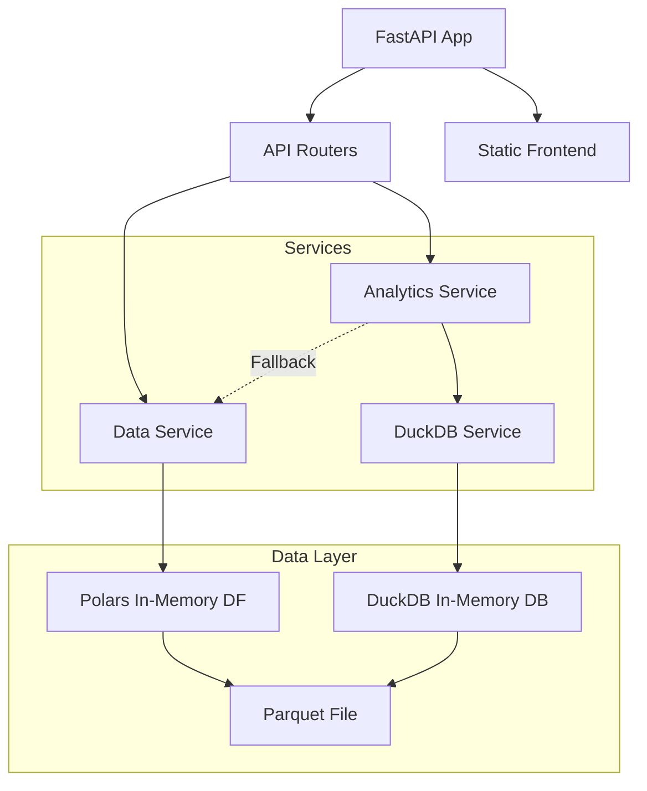
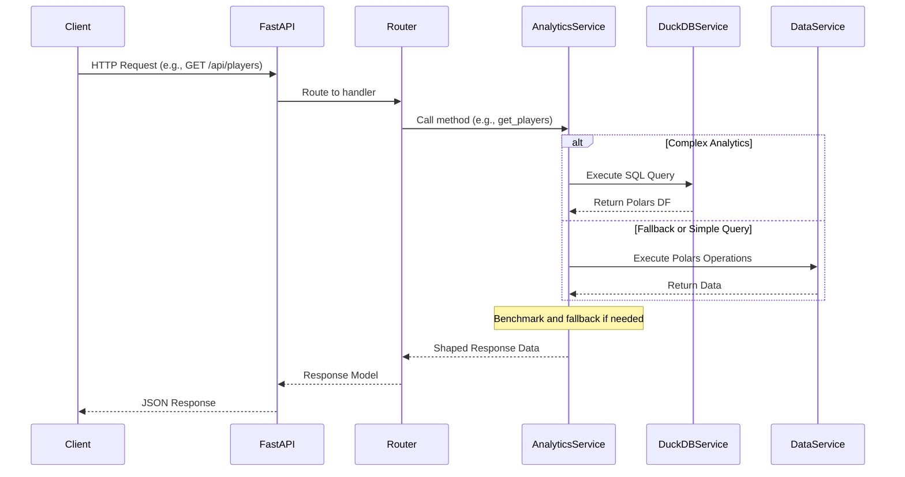

# Backend Detailed Documentation

*Date: 2024-07-15*  
*Scope: Comprehensive breakdown of the FastAPI backend in the Fantasy Draft Analytics application.*

This document provides an in-depth analysis of each module in the `backend/app/` directory, including their responsibilities, key functions, data flows, and interactions. It is based on a thorough review of the codebase. At the end, we note issues and potential improvements, keeping in mind the lean single-container deployment strategy from [ADR-0002](docs/adr/ADR-0002-lean-stack.md), which emphasizes minimal dependencies, low resource usage, and simplicity.

## Overall Architecture
The backend is a FastAPI application using Polars for data manipulation and DuckDB for complex SQL-based analytics. Data is loaded from a Parquet file (`updated_bestball_data.parquet`) at startup. Services are singletons for efficiency. API routers delegate to services, which handle business logic. The app supports serving a static React frontend from the same container for a lean deployment.

Key principles:
- Stateless, in-memory data handling.
- Hybrid Polars/DuckDB with performance-based fallback.
- Minimal dependencies (see `requirements.txt`).
- Logging and basic error handling via HTTPExceptions.



## Module Breakdown

### `app/__init__.py`
- **Purpose**: Package initializer (empty, as it's a standard Python package file).
- **Key Features**: None; implicitly organizes the app as a module.
- **Flow**: Not directly involved in runtime; used for imports.

### `app/main.py`
- **Purpose**: Entry point for the FastAPI application. Initializes the app, configures logging, sets up CORS, includes API routers, and optionally serves static frontend files.
- **Key Components**:
  - Logging setup with INFO level and timestamped format.
  - FastAPI app creation with title, description, version, and docs endpoints.
  - CORS middleware using settings from `core/config.py`.
  - Includes the aggregated API router from `api/__init__.py`.
  - Attempts to mount static files from possible frontend build directories (e.g., `frontend_dist`); falls back to API-only mode if not found.
  - Health check endpoint `/health`.
  - Uvicorn runner for local development.
- **Flow Control**:
  - On startup: Load Polars string cache, configure logging, create app, add middleware, include routers, mount static files if available.
  - Request handling: FastAPI routes requests to included routers or static files.
  - Example: GET `/` serves frontend index.html if available, else a JSON message.
- **Dependencies**: FastAPI, logging, pathlib, polars, uvicorn (for dev).

### `app/core/__init__.py`
- **Purpose**: Package initializer (empty).

### `app/core/config.py`
- **Purpose**: Defines application settings using Pydantic for type-safe configuration.
- **Key Components**:
  - `Settings` class inheriting from `BaseSettings`.
  - Fields: API prefix, project name, allowed CORS origins (list of localhost variants), data path.
  - Loads from `.env` file if present.
  - Instantiates a global `settings` object.
- **Flow**: Accessed globally (e.g., in `main.py` for CORS). No dynamic logic.
- **Dependencies**: pydantic-settings.

### `app/models/__init__.py`
- **Purpose**: Package initializer (empty).

### `app/models/schemas.py`
- **Purpose**: Defines Pydantic models, enums, and response schemas for API contracts.
- **Key Components**:
  - Enums: `Position` (QB, RB, etc.), `SortableColumn`, `SortOrder`, `AggregationType`.
  - Models: `MetadataResponse`, `Player`, `PlayersResponse`, `PositionStats`, `PositionStatsResponse`, `TeamCombination`, `CombinationsResponse`, and many more for various endpoints (e.g., `DraftSlotRow`, `HeatMapCell`).
  - Used for request validation, response serialization, and type safety.
- **Flow**: Models are used in API routers for response types and in services for data shaping.
- **Dependencies**: pydantic, typing, enum.

### `app/services/__init__.py`
- **Purpose**: Package initializer (empty).

### `app/services/data_service.py`
- **Purpose**: Core singleton service for Polars-based data operations. Loads and pre-processes the Parquet data, provides methods for querying players, stats, combinations, etc.
- **Key Components**:
  - `DataService` class (singleton via global `data_service`).
  - Initialization: Loads Parquet, corrects pick values (handles signed/unsigned overflow), computes metadata (unique players, drafts, teams).
  - Methods: `get_players` (filter, sort, paginate with draft percentage), `get_player_details` (stats and raw picks), `get_position_stats`, `get_first_player_draft_stats`, `get_position_draft_counts_by_round`, `get_player_combinations` (teams with required players in N rounds), `get_roster_construction` (position counts per team).
  - Utility: `log_memory_usage` for monitoring.
- **Flow Control**:
  - Startup: Load data into Polars LazyFrame, collect, cache metadata.
  - Query: Use Polars expressions for grouping, filtering, aggregation. Example: `get_players` builds a lazy query, applies filters/sorts, collects, converts to Pydantic models.
  - Memory-aware: Logs usage before/after init.
- **Dependencies**: polars, psutil, logging, os.

### `app/services/duckdb_service.py`
- **Purpose**: Singleton for DuckDB integration, providing SQL query execution over the Parquet data, returning Polars DataFrames.
- **Key Components**:
  - `DuckDBService` class (singleton via `duckdb_service`).
  - Initialization: Creates in-memory connection, enables object cache, creates a view on Parquet with pick correction, registers Polars DF for hybrid queries.
  - Method: `query(sql, params)` – Executes SQL, returns Polars DF via Arrow.
- **Flow**: Services like `analytics_service` use it for complex queries. Ensures read-only, lazy loading.
- **Dependencies**: duckdb, polars, logging, os.

### `app/services/analytics_service.py`
- **Purpose**: Higher-level service using DuckDB for analytics, with performance fallback to `data_service` (Polars) if faster.
- **Key Components**:
  - `AnalyticsService` class (singleton).
  - Methods: Optimized versions of `get_players`, `get_player_combinations`; new analytics like `get_draft_slot_correlation` (player correlation by slot), `get_heat_map` (round x position counts), `get_stacks` (QB/receiver stacks), `get_adp_drift` (ADP changes over time).
  - Fallback logic: Times DuckDB query; if >50ms and Polars 20% faster, uses Polars.
- **Flow Control**:
  - For each method: Build SQL, query DuckDB, time it; optionally benchmark Polars and switch if better; shape results to dicts/models.
  - Example: `get_players` dynamically builds SQL with filters, computes totals, paginates.
- **Dependencies**: polars, time, logging; imports schemas and other services.

```mermaid
flowchart TD
    A[Start: Analytics Method Called]
    A --> B{Is Query Complex?}
    B -- Yes --> C[Build SQL]
    C --> D[Time DuckDB Query]
    D --> E{DuckDB Time >50ms?}
    E -- No --> F[Use DuckDB Result]
    E -- Yes --> G[Benchmark Polars Equivalent]
    G --> H{Polars >20% Faster?}
    H -- Yes --> I[Use Polars Result]
    H -- No --> F
    B -- No --> J[Use DataService (Polars)]
    F --> K[Shape to Models/Dicts]
    I --> K
    J --> K
    K --> L[Return to Router]
```

### `app/api/__init__.py`
- **Purpose**: Aggregates all API routers into a single router.
- **Key Components**: Creates `router`, includes sub-routers from other api modules with prefixes/tags.
- **Flow**: Included in `main.py`; centralizes route registration.
- **Dependencies**: fastapi.APIRouter.

### `app/api/analytics.py`
- **Purpose**: Router for analytics endpoints (e.g., /analytics/heat-map, /stacks, /draft-slot, /drift).
- **Key Components**: APIRouter with prefix/tags; endpoints delegate to `analytics_service`, handle exceptions.
- **Flow**: Request -> validate queries -> call service -> return response model.
- **Dependencies**: fastapi, logging, schemas, analytics_service.

### `app/api/combinations.py`
- **Purpose**: Router for player combinations and roster construction.
- **Key Components**: Endpoints for /combinations/ (teams with required players) and /roster-construction/.
- **Flow**: Similar to above; uses `analytics_service` for combinations, `data_service` for rosters.
- **Dependencies**: fastapi, typing, logging, schemas, services.

### `app/api/metadata.py`
- **Purpose**: Router for /metadata/ endpoint.
- **Key Components**: Single GET returning dataset metadata.
- **Flow**: Calls `data_service.get_metadata()`, shapes to model.
- **Dependencies**: fastapi, logging, schemas, data_service.

### `app/api/players.py`
- **Purpose**: Router for player-related endpoints (/players/, /search, /details).
- **Key Components**: Filtering/pagination for lists, search, details with stats.
- **Flow**: Uses `analytics_service` for lists/search, `data_service` for details; computes pagination info.
- **Dependencies**: fastapi, typing, logging, schemas, services.

### `app/api/positions.py`
- **Purpose**: Router for position stats (/positions/stats, /first_player, /by_round, /roster-construction).
- **Key Components**: Aggregations by position, round counts, roster constructions.
- **Flow**: Delegates to `data_service`; shapes responses.
- **Dependencies**: fastapi, typing, logging, schemas, data_service.

### `backend/requirements.txt`
- **Purpose**: Lists dependencies with versions (e.g., fastapi>=0.108.0, polars>=0.20.3, duckdb>=0.10.0).
- **Notes**: Lean set; no heavy extras. Consider pinning exact versions for reproducibility.

## Flow Control Overview
1. **Startup**: `main.py` initializes app, loads services (which load data into memory via Polars/DuckDB).
2. **Request Handling**: FastAPI routes to appropriate api router -> validates params -> calls service method.
3. **Service Layer**: `analytics_service` prefers DuckDB for complex queries, falls back to Polars if slower; `data_service` uses Polars directly.
4. **Data Access**: Queries hit in-memory Parquet views/tables; results shaped to Pydantic models.
5. **Response**: JSON via FastAPI, with error handling.
6. **Error Flow**: Exceptions logged and raised as HTTP 500 with details.



## Noted Issues and Improvements
Based on code review and existing architecture notes, here are backend-specific issues. Improvements respect ADR-0002's lean principles (no new deps, maintain low RAM/CPU, single container).

### Issues
1. **Low Test Coverage**: ~20% (from arch doc); tests exist but limited to units in `tests/`. Risk of regressions.
2. **Performance Bottlenecks**: Combination queries can return heavy payloads; no server-side pagination in some endpoints (e.g., combinations return up to 1000 teams with full player lists).
3. **Cache Loss on Deploy**: In-memory `@lru_cache` and service singletons reset on container restart; affects hot endpoints.
4. **Data Loading**: Fixed Parquet path; if data grows (>12MB now), memory usage could exceed t3a.small limits (2GB RAM).
5. **Dependency Versions**: Uses >= specifiers; potential for breaking changes on updates.
6. **No Authentication**: API is open; fine for current scope but risk if exposed publicly.
7. **Limited Error Handling**: Basic HTTPExceptions; no centralized logging/monitoring beyond std logging.
8. **Debug Logging in Deps**: Grep found debug logs in websockets/yaml, but no custom TODO/FIXME in app code.
9. **Hybrid System Complexity**: DuckDB/Polars fallback adds code but ensures perf; could be overkill if DuckDB always wins.
10. **Polars Deprecations**: Tests reveal deprecation warnings for `pl.count()` (use `pl.len()` instead) and CategoricalRemappingWarning due to mismatched string encodings in merges.

### Proposed Improvements
1. **Increase Testing**: Add more pytest units for services (e.g., mock Parquet), integration tests for endpoints. Keep lean: no new tools.
2. **Pagination for Heavy Endpoints**: Add offset/limit to combinations/roster endpoints; reduces payload size.
3. **Persistent Caching**: Use file-based cache (e.g., pickle results to /tmp) for hot queries; clears on deploy but survives restarts within container lifecycle.
4. **Monitor Memory**: Enhance `log_memory_usage` to alert if >80% RAM; log to CloudWatch as per ADR.
5. **Pin Dependencies**: Update `requirements.txt` to exact versions (e.g., fastapi==0.108.0) for stability.
6. **Optional Auth**: If needed, add simple API key via FastAPI dependency; minimal overhead.
7. **Query Optimization**: Profile slow SQL in DuckDB; index if possible (in-memory, so limited).
8. **Data Update Mechanism**: Script to refresh Parquet without rebuild; fits lean deploy via `deploy.sh`.
9. **Fix Polars Warnings**: Replace all `pl.count()` with `pl.len()`; ensure consistent categorical encodings or use StringCache for merges.

These changes maintain the single-container, low-cost model while addressing pain points. 