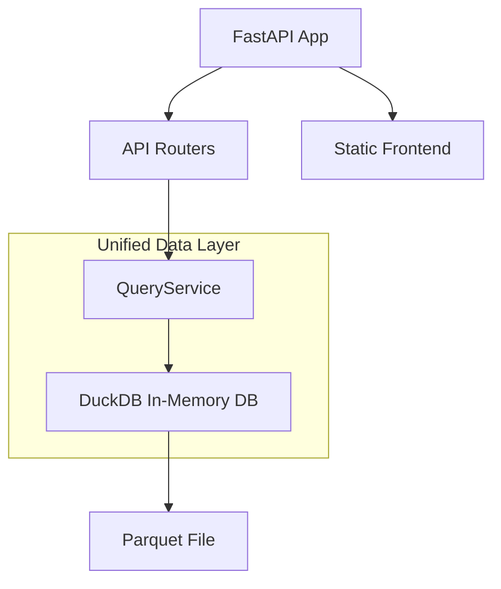
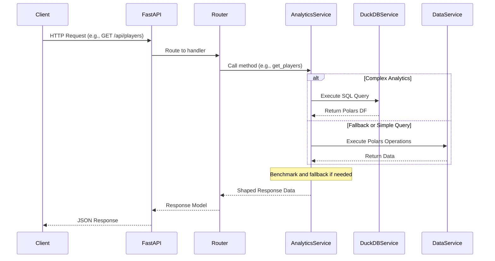

# Backend Detailed Documentation

*Date: 2024-07-15*
*Scope: Comprehensive breakdown of the FastAPI backend in the Fantasy Draft Analytics application.*

This document provides an in-depth analysis of each module in the `backend/app/` directory, including their responsibilities, key functions, data flows, and interactions. It is based on a thorough review of the codebase. At the end, we note issues and potential improvements, keeping in mind the lean single-container deployment strategy from [ADR-0002](docs/adr/ADR-0002-lean-stack.md), which emphasizes minimal dependencies, low resource usage, and simplicity.

## Overall Architecture

The backend is a FastAPI application using DuckDB for all data operations. Data is loaded from a Parquet file (`updated_bestball_data.parquet`) at startup into an in-memory DuckDB instance. A single `QueryService` provides all data access functionality through SQL queries. The app supports serving a static React frontend from the same container for a lean deployment.

Key principles:

- Single, unified data service for all operations
- SQL-based queries via embedded DuckDB for optimal performance
- Stateless, in-memory data handling
- Minimal dependencies (see `requirements.txt`)
- Logging and basic error handling via HTTPExceptions



## Module Breakdown

### `app/__init__.py`

- **Purpose**: Package initializer (empty, as it's a standard Python package file).
- **Key Features**: None; implicitly organizes the app as a module.
- **Flow**: Not directly involved in runtime; used for imports.

### `app/main.py`

- **Purpose**: Entry point for the FastAPI application. Initializes the app, configures logging, sets up CORS, includes API routers, and optionally serves static frontend files.
- **Key Components**:
  - Logging setup with INFO level and timestamped format.
  - FastAPI app creation with title, description, version, and docs endpoints.
  - CORS middleware using settings from `core/config.py`.
  - Includes the aggregated API router from `api/__init__.py`.
  - Attempts to mount static files from possible frontend build directories (e.g., `frontend_dist`); falls back to API-only mode if not found.
  - Health check endpoint `/health`.
  - Uvicorn runner for local development.
- **Flow Control**:
  - On startup: Load Polars string cache, configure logging, create app, add middleware, include routers, mount static files if available.
  - Request handling: FastAPI routes requests to included routers or static files.
  - Example: GET `/` serves frontend index.html if available, else a JSON message.
- **Dependencies**: FastAPI, logging, pathlib, polars, uvicorn (for dev).

### `app/core/__init__.py`

- **Purpose**: Package initializer (empty).

### `app/core/config.py`

- **Purpose**: Defines application settings using Pydantic for type-safe configuration.
- **Key Components**:
  - `Settings` class inheriting from `BaseSettings`.
  - Fields: API prefix, project name, allowed CORS origins (list of localhost variants), data path.
  - Loads from `.env` file if present.
  - Instantiates a global `settings` object.
- **Flow**: Accessed globally (e.g., in `main.py` for CORS). No dynamic logic.
- **Dependencies**: pydantic-settings.

### `app/models/__init__.py`

- **Purpose**: Package initializer (empty).

### `app/models/schemas.py`

- **Purpose**: Defines Pydantic models, enums, and response schemas for API contracts.
- **Key Components**:
  - Enums: `Position` (QB, RB, etc.), `SortableColumn`, `SortOrder`, `AggregationType`.
  - Models: `MetadataResponse`, `Player`, `PlayersResponse`, `PositionStats`, `PositionStatsResponse`, `TeamCombination`, `CombinationsResponse`, and many more for various endpoints (e.g., `DraftSlotRow`, `HeatMapCell`).
  - Used for request validation, response serialization, and type safety.
- **Flow**: Models are used in API routers for response types and in services for data shaping.
- **Dependencies**: pydantic, typing, enum.

### `app/services/__init__.py`

- **Purpose**: Package initializer (empty).

### `app/services/query_service.py`

- **Purpose**: Unified singleton service for all data operations using DuckDB. Replaces the previous three-service architecture with a single, coherent interface.
- **Key Components**:
  - `QueryService` class (singleton via global `query_service`).
  - Initialization: Creates in-memory DuckDB connection, enables object cache, creates a view on Parquet with pick correction and data type fixes.
  - Core method: `query(sql, params)` – Executes parameterized SQL, returns Polars DF via Arrow.
  - Data methods: `get_metadata`, `get_players`, `get_player_details`, `get_position_stats`, etc.
  - Analytics methods: `get_heat_map`, `get_stacks`, `get_draft_slot_correlation`, `get_adp_drift`, `get_player_combinations`.
- **Flow Control**:
  - Startup: Load data into DuckDB, create optimized views, cache connection.
  - Query: Build parameterized SQL for security, execute via DuckDB, shape results to Pydantic models.
  - All methods use the same underlying `query()` method for consistency.
- **Dependencies**: duckdb, polars, pathlib, logging; imports schemas.

```mermaid
flowchart TD
    A[Start: Analytics Method Called]
    A --> B{Is Query Complex?}
    B -- Yes --> C[Build SQL]
    C --> D[Time DuckDB Query]
    D --> E{DuckDB Time >50ms?}
    E -- No --> F[Use DuckDB Result]
    E -- Yes --> G[Benchmark Polars Equivalent]
    G --> H{Polars >20% Faster?}
    H -- Yes --> I[Use Polars Result]
    H -- No --> F
    B -- No --> J[Use DataService (Polars)]
    F --> K[Shape to Models/Dicts]
    I --> K
    J --> K
    K --> L[Return to Router]
```

### `app/api/__init__.py`

- **Purpose**: Aggregates all API routers into a single router.
- **Key Components**: Creates `router`, includes sub-routers from other api modules with prefixes/tags.
- **Flow**: Included in `main.py`; centralizes route registration.
- **Dependencies**: fastapi.APIRouter.

### `app/api/analytics.py`

- **Purpose**: Router for analytics endpoints (e.g., /analytics/heat-map, /stacks, /draft-slot, /drift).
- **Key Components**: APIRouter with prefix/tags; endpoints delegate to `analytics_service`, handle exceptions.
- **Flow**: Request -> validate queries -> call service -> return response model.
- **Dependencies**: fastapi, logging, schemas, analytics_service.

### `app/api/combinations.py`

- **Purpose**: Router for player combinations and roster construction.
- **Key Components**: Endpoints for /combinations/ (teams with required players) and /roster-construction/.
- **Flow**: Similar to above; uses `analytics_service` for combinations, `data_service` for rosters.
- **Dependencies**: fastapi, typing, logging, schemas, services.

### `app/api/metadata.py`

- **Purpose**: Router for /metadata/ endpoint.
- **Key Components**: Single GET returning dataset metadata.
- **Flow**: Calls `data_service.get_metadata()`, shapes to model.
- **Dependencies**: fastapi, logging, schemas, data_service.

### `app/api/players.py`

- **Purpose**: Router for player-related endpoints (/players/, /search, /details).
- **Key Components**: Filtering/pagination for lists, search, details with stats.
- **Flow**: Uses `analytics_service` for lists/search, `data_service` for details; computes pagination info.
- **Dependencies**: fastapi, typing, logging, schemas, services.

### `app/api/positions.py`

- **Purpose**: Router for position stats (/positions/stats, /first_player, /by_round, /roster-construction).
- **Key Components**: Aggregations by position, round counts, roster constructions.
- **Flow**: Delegates to `data_service`; shapes responses.
- **Dependencies**: fastapi, typing, logging, schemas, data_service.

### `backend/requirements.txt`

- **Purpose**: Lists dependencies with versions (e.g., fastapi>=0.108.0, polars>=0.20.3, duckdb>=0.10.0).
- **Notes**: Lean set; no heavy extras. Consider pinning exact versions for reproducibility.

## Flow Control Overview

1. **Startup**: `main.py` initializes app, loads services (which load data into memory via Polars/DuckDB).
2. **Request Handling**: FastAPI routes to appropriate api router -> validates params -> calls service method.
3. **Service Layer**: `analytics_service` prefers DuckDB for complex queries, falls back to Polars if slower; `data_service` uses Polars directly.
4. **Data Access**: Queries hit in-memory Parquet views/tables; results shaped to Pydantic models.
5. **Response**: JSON via FastAPI, with error handling.
6. **Error Flow**: Exceptions logged and raised as HTTP 500 with details.



## HTTPS, Nginx, and Security Architecture (2025-07)

**New in July 2025:**

- The backend is now deployed behind an **Nginx reverse proxy** on the same EC2 instance.
- **Let's Encrypt** (via Certbot) provides free SSL certificates, automatically renewed.
- Nginx terminates HTTPS (443) and proxies all traffic to the FastAPI app running on localhost:8000 (HTTP only).
- All HTTP (port 80) traffic is redirected to HTTPS.
- Security headers and rate limiting are enforced at the Nginx layer.
- The FastAPI app is **never exposed directly to the public internet**; only Nginx is.
- See `docs/HTTPS_SETUP.md` for full setup and maintenance instructions.

**Benefits:**

- No need for AWS CloudFront or ACM (Amazon Certificate Manager)
- No extra AWS costs for HTTPS
- Fully automated, secure, and maintainable
- Certificates auto-renew via cron

**Key files:**

- `nginx.conf` (Nginx config)
- `docker-compose.prod.yml` (production stack)
- `scripts/setup-https.sh` (initial setup)
- `docs/HTTPS_SETUP.md` (full guide)

---

### Updated Issues and Improvements

- **SQL Injection Risk**: (Resolved July 2025) All DuckDB queries in `analytics_service` now use parameterized queries. Bandit suppressions are documented and safe. No user input is ever interpolated directly into SQL.
- **HTTPS/SSL**: Now handled by Nginx + Let's Encrypt, not CloudFront/ACM. No AWS-managed certificate required.
- **Security**: Nginx enforces security headers, rate limiting, and HTTP→HTTPS redirect. FastAPI CORS is still enforced at the app layer.
- **Deployment**: Remains a single-container (app) plus Nginx/Certbot sidecars, all orchestrated via Docker Compose.

---

### 1.3 Service Responsibilities

- **QueryService**: The unified service that handles all data operations. Manages the DuckDB connection, loads data from the Parquet file at startup, and provides all query methods including player lookups, analytics, combinations, and statistics. Uses SQL for optimal performance and returns data shaped for API responses.

*No external services – ideal for stateless single-process deployment.*
