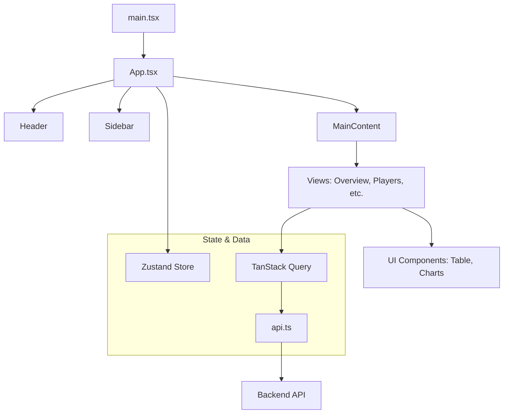
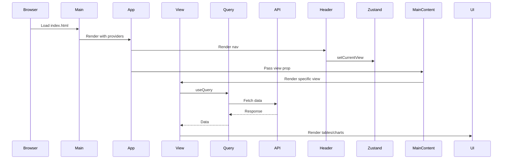

# Frontend Detailed Documentation

*Date: 2024-07-16*  
*Scope: Comprehensive breakdown of the React + TypeScript + Vite frontend in the Fantasy Draft Analytics application.*

This document provides an in-depth analysis of the frontend codebase, including key files, components, data flows, and interactions. It is based on a thorough review of the source code. At the end, we note issues and potential improvements, focusing on maintaining a lean, performant single-page application that builds to static assets served by the backend.

## Overall Architecture
The frontend is a React application built with Vite for fast development and bundling, using TypeScript for type safety. It leverages Mantine for UI components, TanStack Query for data fetching and caching, Zustand for lightweight global state, and Recharts for visualizations. The app is a single-page application (SPA) without client-side routing; views are managed via state. Data is fetched from the FastAPI backend via a custom `api.ts` service.

Key principles:
- Reactive data fetching with caching to minimize requests.
- Global state for UI concerns (e.g., current view, filters).
- Responsive, modern UI with Tailwind CSS and Mantine theming.
- Testable with Vitest and React Testing Library.

## Module Breakdown

### `src/main.tsx`
- **Purpose**: Entry point; renders the root component with providers.
- **Key Components**: Wraps `App` in `StrictMode`, `MantineProvider` for theming.
- **Flow**: Mounts to #root; imports polyfills and CSS.
- **Dependencies**: react, react-dom, mantine.

### `src/App.tsx`
- **Purpose**: Root component; sets up providers and layout.
- **Key Components**: `QueryClientProvider` with custom options (staleTime, etc.), `MantineProvider`, `Notifications`. Renders `Header`, `Sidebar`, `MainContent` based on Zustand state.
- **Flow**: Uses `useAppStore` for currentView; passes to MainContent.
- **Dependencies**: tanstack/react-query, mantine, zustand.

### `src/components/layout/Header.tsx`
- **Purpose**: Top navigation bar with view switches.
- **Key Components**: Buttons for views (Overview, Players, etc.) with icons; uses Zustand to set currentView.
- **Flow**: On click, updates global state to switch views.
- **Dependencies**: zustand.

### `src/components/layout/Sidebar.tsx`
- **Purpose**: Left sidebar with dataset metadata stats.
- **Key Components**: Fetches metadata via TanStack Query; displays loading skeleton or stats (players, drafts, teams).
- **Flow**: On mount, queries /metadata; renders stats or error.
- **Dependencies**: tanstack/react-query, apiService.

### `src/components/layout/MainContent.tsx`
- **Purpose**: Renders the active view based on prop.
- **Key Components**: Switch statement to render specific View components (OverviewView, PlayersView, etc.).
- **Flow**: Receives view prop from App; conditionally renders.
- **Dependencies**: Imports various views.

### `src/components/layout/OverviewView.tsx`
- **Purpose**: Dashboard view with key metrics and charts.
- **Key Components**: Fetches metadata, position stats, round counts. Renders metric cards, pie/bar charts using Recharts, position filters with Select/SegmentedControl.
- **Flow**: Uses queries with dependencies (position, aggregation); memoizes chart data; handles loading.
- **Dependencies**: tanstack/react-query, recharts, mantine.

### `src/components/layout/PlayersView.tsx`
- **Purpose**: Player search and listing view.
- **Key Components**: Filters (search input, MultiSelect positions, PlayerAutocomplete), PlayerTable, pagination. Fetches players with custom hook; details on click.
- **Flow**: State for page/filters; query with placeholders; handles selection for details fetch.
- **Dependencies**: tanstack/react-query, mantine, custom hook.

### `src/components/analytics/DraftSlotTab.tsx`
- **Purpose**: Analytics tab for draft slot correlations.
- **Key Components**: Controls (NumberInput slot, SegmentedControl metric, Select topN), BarChart, Table. Uses custom hook for data; popover for info.
- **Flow**: State for params; query on change; memoizes chart data.
- **Dependencies**: tanstack/react-query, recharts, mantine, custom hook.

### `src/services/api.ts`
- **Purpose**: Axios-based API client with methods for all endpoints.
- **Key Components**: Dynamic baseURL (local vs prod), interceptors for logging, typed methods (getPlayers, getMetadata, etc.).
- **Flow**: Handles requests/responses; used by queries/hooks.
- **Dependencies**: axios.

### `src/store/appStore.ts`
- **Purpose**: Zustand store for global state.
- **Key Components**: State for selectedPlayers, currentView, filters; actions to set/clear.
- **Flow**: Used across components for shared state without props drilling.
- **Dependencies**: zustand, devtools.

### `src/types/index.ts`
- **Purpose**: TypeScript types mirroring backend schemas.
- **Key Components**: Interfaces for responses (PlayersResponse, etc.), enums (Position, SortableColumn).
- **Flow**: Ensures type safety in components and API calls.
- **Dependencies**: None.

### `src/hooks/useDraftSlotCorrelation.ts`
- **Purpose**: Custom hook wrapping TanStack Query for draft slot data.
- **Key Components**: useQuery with key based on params; configurable enabled/staleTime.
- **Flow**: Abstracts fetching logic for reuse.
- **Dependencies**: tanstack/react-query, apiService.

### `vite.config.ts`
- **Purpose**: Vite configuration for build and testing.
- **Key Components**: Plugins (react), aliases (@ -> src), test setup (jsdom, globals).
- **Flow**: Defines dev/build behavior.
- **Dependencies**: vite, vitest/config, @vitejs/plugin-react.

### `package.json`
- **Purpose**: Dependencies and scripts (dev, build, test, lint).
- **Notes**: Uses pnpm; deps include react, mantine, tanstack/query, recharts, zustand.

## Flow Control Overview
1. **Startup**: `main.tsx` renders App with providers.
2. **Rendering**: App sets up layout; MainContent switches views based on state.
3. **Navigation**: Header buttons update Zustand currentView.
4. **Data Fetching**: Views use TanStack Query hooks; api.ts handles requests.
5. **State Updates**: Zustand actions for filters/selection; triggers re-queries.
6. **Error Handling**: Queries show loaders/alerts on error.

## Noted Issues and Improvements
From code review and grep (TODO in api.ts for type, temp comment in PlayersView).

### Issues
1. **Low Test Coverage**: ~15% (arch doc); only DraftSlotTab.spec.tsx exists.
2. **No Client-Side Routing**: State-based views; no deep linking/sharing.
3. **Heavy Payloads**: Large player lists/charts may cause perf issues on slow connections.
4. **Manual Type Sync**: types/index.ts mirrors backend; prone to drift without codegen.
5. **Limited Error Handling**: Basic alerts; no global handler or retry UI.
6. **Accessibility**: Mantine helps, but custom components (e.g., charts) may need aria labels.
7. **Mobile Responsiveness**: Uses responsive grids, but some tables may overflow.
8. **Debug Code**: Temp disable of Collapse in PlayersView; cleanup needed.

### Proposed Improvements
1. **Boost Testing**: Add Vitest specs for views/hooks; aim for 50%+ coverage.
2. **Add Routing**: Integrate react-router for views; enables deep links with minimal bundle increase.
3. **Optimize Data**: Implement infinite scrolling for lists; compress responses if needed.
4. **Auto-Generate Types**: Use datamodel-codegen from backend schemas.
5. **Global Errors**: Add QueryErrorBoundary and toast notifications.
6. **A11y Audit**: Add aria props; test with screen readers.
7. **Responsive Tweaks**: Use Mantine DataTable for better mobile tables.
8. **Cleanup**: Remove temp code; add TODO tracking in issues.

These keep the build lean and fast-loading. 